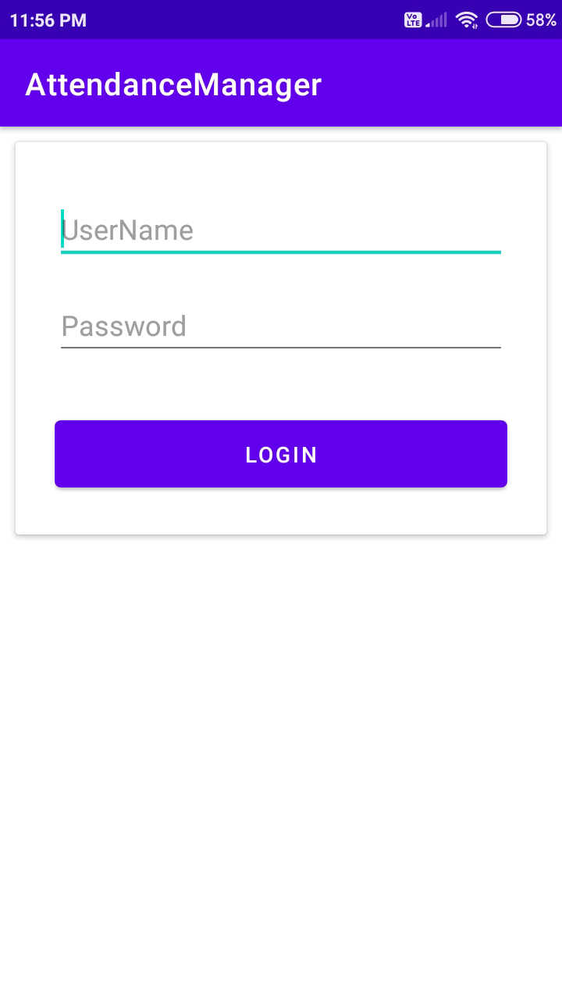
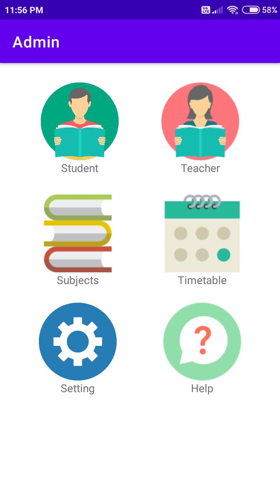
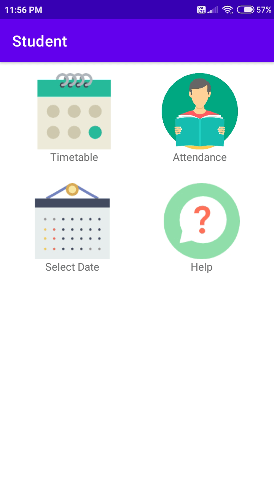
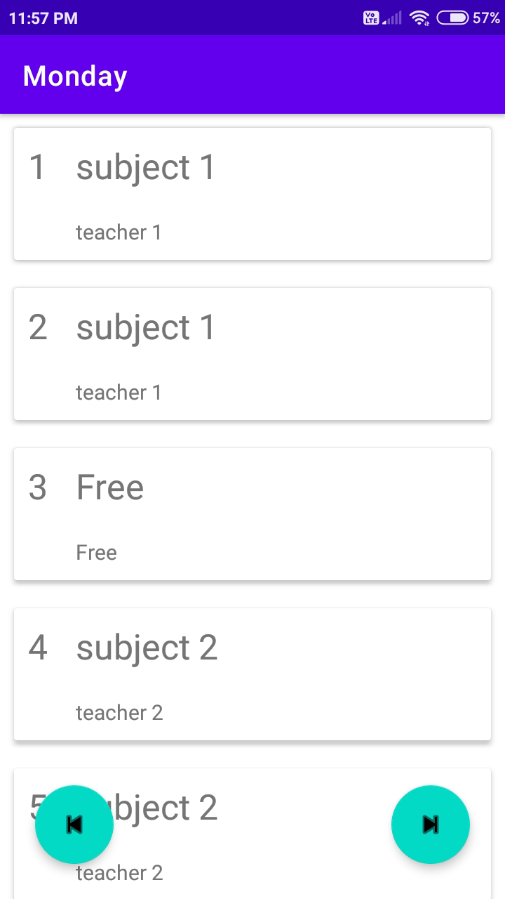
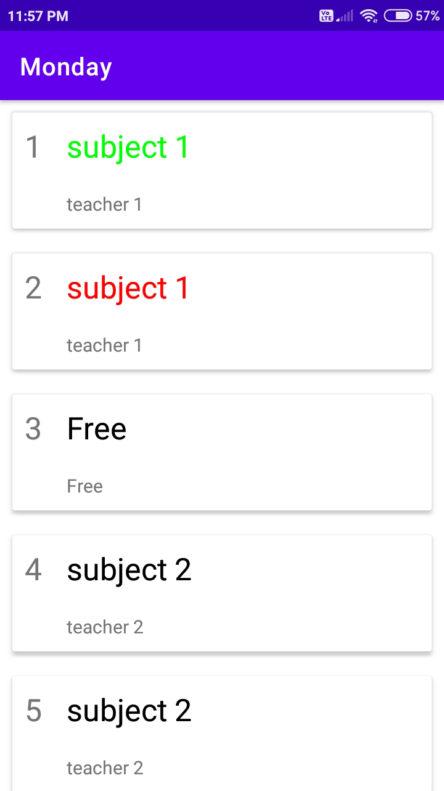
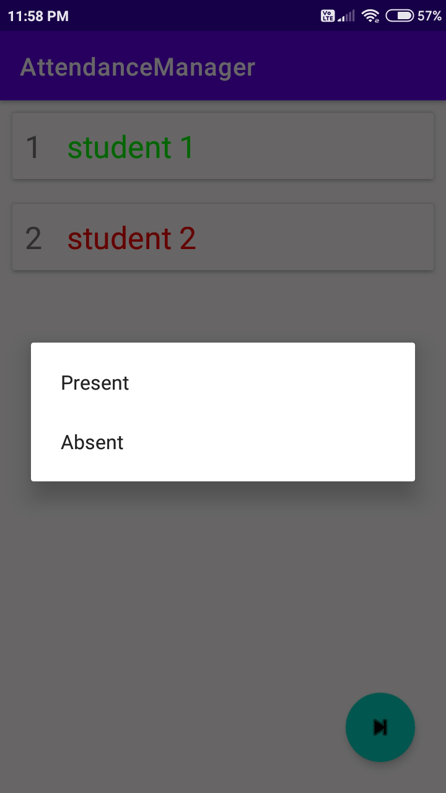

# Attendance Manager

This app solves the attendance management problems faced by college or
university students who need to compulsorily attend a minimum
percentage of classes each semester or session.

## Features

- Admin can add teachers, students, subjects list.
- Admin can create timetable.
- Teachers and students can view their timetable.
- Teachers can take attendance.
- Students can view their attendance.
- Students and teacher can view their attence history.

## Screenshots

